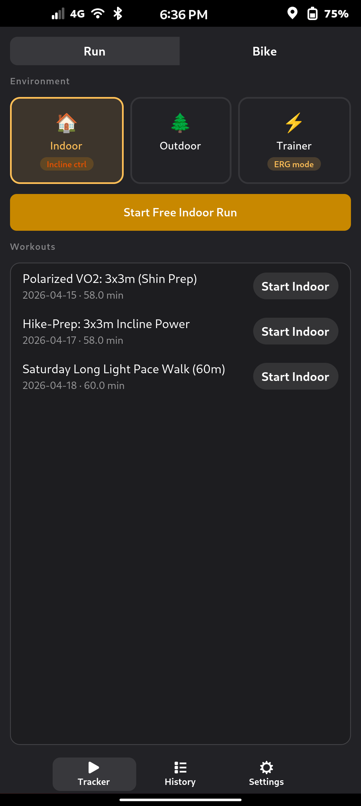
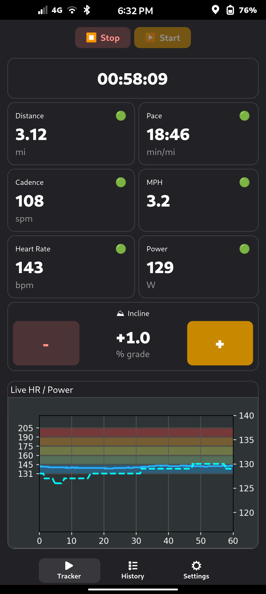
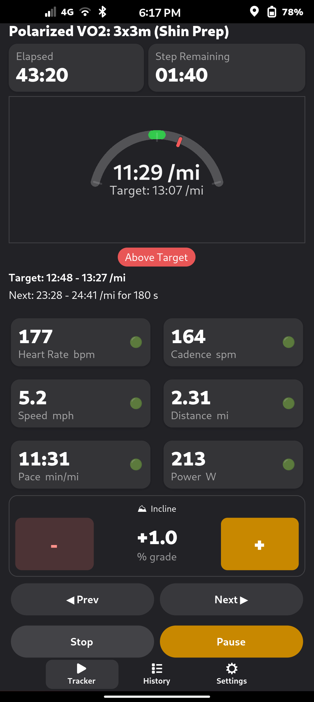
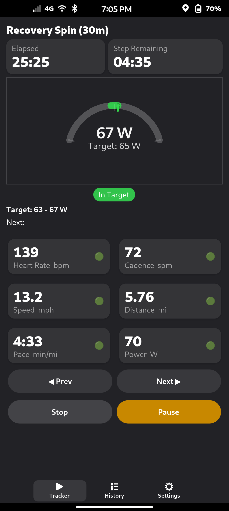
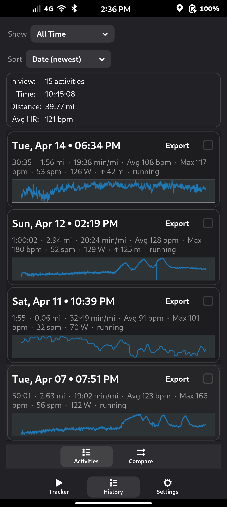
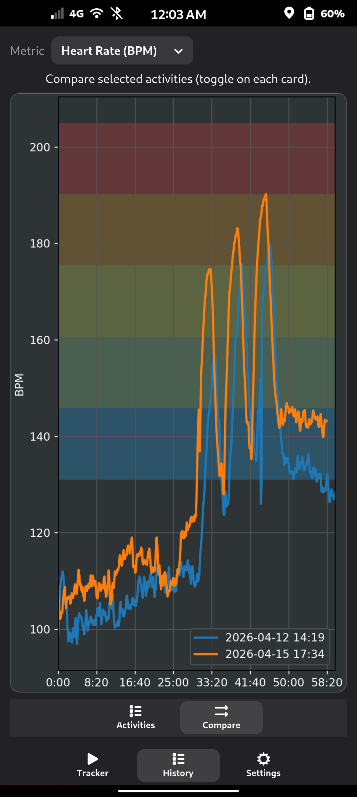

# Fitness Tracker

An open-source application for tracking sensor data from Bluetooth Low Energy (BLE) devices in real time, recording sessions, and visualizing your workout history.

## Features

* **Sensor Monitoring**: Stream from BLE supported devices.
  *  **Heart Rate**
  *  **Foot Pods**
  *  **Bike Smart Trainers** 
* **Workouts**: Add workout fit/json files and visualize the workout during your session.
* **Session Recording**: Start and stop recording sessions; data is stored locally in SQLite.
* **History & Visualization**: Browse past activities by day, week, month, or all time with summary stats and sparkline previews.
* **Two-Way Sync**: Push local sessions to a remote database and pull remote sessions back to your local store.
* **Intervals.ICU**: Upload history to intervals.icu and download workouts for the week.
* **Dark & Light Mode**: Automatic theme adaptation based on your system preferences.

## Prerequisites

* BLE adapter (Bluetooth Low Energy support)
* BLE sensor

## Validated Devices

* [Heart Rate](https://github.com/luigi311/fitness-tracker-validated-hardware/tree/main/devices/heart-rate-monitors)
* [Foot Pods](https://github.com/luigi311/fitness-tracker-validated-hardware/tree/main/devices/foot-pods)
* [Bike Trainers](https://github.com/luigi311/fitness-tracker-validated-hardware/tree/main/devices/bike-trainers)

## Configuration

1. **Set Personal information**: Set your weight, heart rate, ftp values so it can be used to calculate your zones for zone targeting
2. **Select Devices**: Expand the sport sensors and scan/select the sensors for each given category
3. **Set data providers**: Expand the data providers you wish to enable and input information to pull/push your sessions externally
4. **Actions**: Save settings once everything is configured and fetch/upload when needed

## Usage

* **Tracker Page**: Used to start your session, select the sport and enviornment and then start a workout/freerun and then click start when ready

* **History Page**: See previous sessions with filter for Last 7 Days, Last 30 Days, or All Time. Tick individual sessions and click compare to see more detailed graphs.

* **Settings Page**: Configure your settings and upload/download your sessions/workouts

## Screenshots

  
  

  
  

  
  

