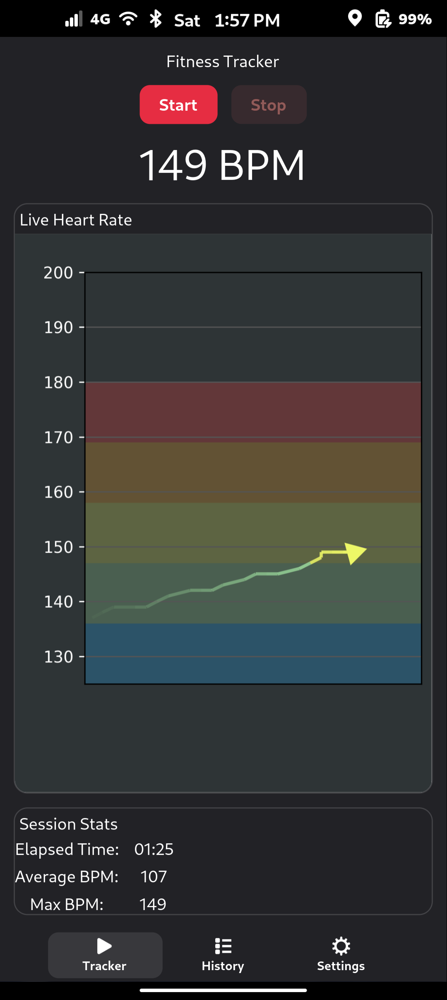
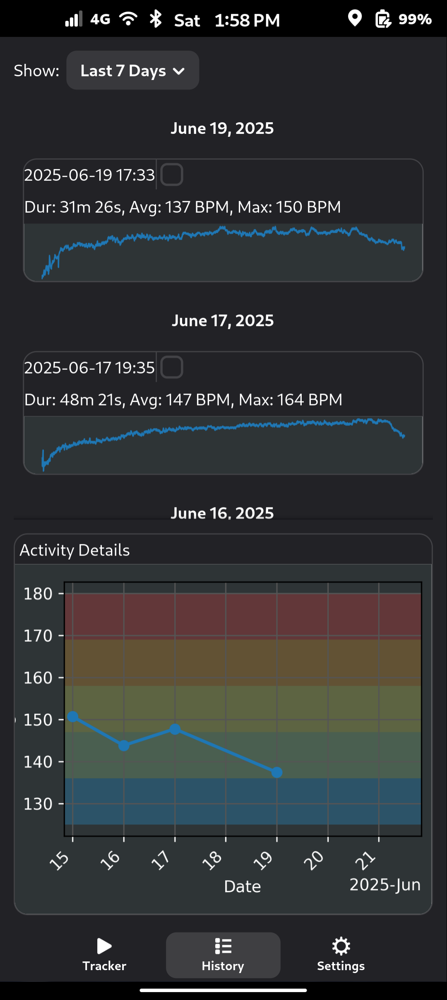
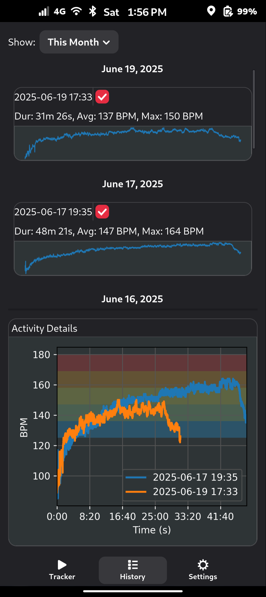

# Fitness Tracker

An open-source application for tracking heart-rate data from Bluetooth Low Energy (BLE) devices in real time, recording sessions, and visualizing your workout history.

## Features

* **Live Heart-Rate Monitoring**: Stream BPM, RR intervals, and energy (kJ) from supported BLE chest straps.
* **Session Recording**: Start and stop recording sessions; data is stored locally in SQLite.
* **History & Visualization**: Browse past activities by day, week, month, or all time with summary stats (duration, avg/max BPM) and sparkline previews.
* **Two-Way Sync**: Push local sessions to a remote database and pull remote sessions back to your local store.
* **Configurable**: Set custom database DSN, select your BLE device, set your resting and max heart rate.
* **Dark & Light Mode**: Automatic theme adaptation based on your system preferences.

## Prerequisites

* BLE adapter (Bluetooth Low Energy support)

## Supported Devices

* Any dedicated BLE heart rate monitor that follows the BLE GATT standard (Handled by [BleakHeart](https://github.com/fsmeraldi/bleakheart))

## Configuration

1. **Set Database DSN**: In Settings, enter your remote database DSN (e.g., PostgreSQL URL) to enable syncing.
2. **Select BLE Device**: Choose your heart-rate monitor and save settings.
3. **Set Resting and Max Heart Rate**: Set your heart rate values so it can be used to calculate your zones for zone targeting

## Usage

* **Start Recording**: Click **Start** to begin a new session.

* **Stop Recording**: Click **Stop** to end the session and save data.

* **Sync Data**: Click **Sync to Server** to push/pull sessions to/from the remote database.

* **View History**: Switch to the **History** tab, filter by Last 7 Days, This Month, or All Time. Tick sessions to overlay detailed plots.

## Screenshots

  &nbsp;
  &nbsp;
  

